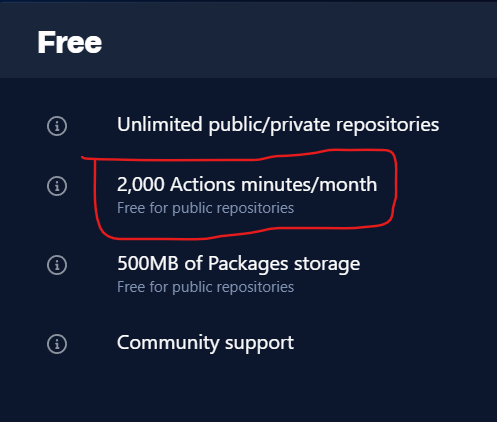

## GWFRecon    

Perform reconnaissance on web applications by taking advantages of [github CI/CD workflow](https://resources.github.com/ci-cd/). The tool basically allows user to perform initial reconnaissance on a web application like Subdomain Enumeration, port scanning, Javascript reconnaissance, Directory bruteforce, Misconfiguration Scanner by using various opensource tools. The tool basically do the following things : 

* Generate github CI/CD yml template according to the user input and scan type  
* Create a remote github repo
* Push the workflow files into repo  
* Trigger the workflow, and Monitor the workflow run  
* After finishing, clone remote repo with scan results
* Delete the remote repo 


### Requirements   

* Need to provide Github [Personal Access Token](https://docs.github.com/en/authentication/keeping-your-account-and-data-secure/creating-a-personal-access-token) and github username in [config.py](config.py) file.   
* Also when generating token select/enable repo, workflow and delete_repo controls, then generate tokens.   

   
   

* With free Github account, it gives 2000 min/month CI/CD action times for free for public repos.  

   

### Installation :  

* Run setup.sh to configure everything. 
* OR   
* Install python3, pip3 and run command `pip3 install -r requirements.txt`

### Usage :  

__SubDomain passive enumeration :__  

```  
./gwfrecon.py SubDomainEnum -d google.com -p
```  

__SubDomain Active enumeration :__  

```  
./gwfrecon.py SubDomainEnum -d google.com 
``` 

__Portscanning using massdns generated result file :__   

```  
./gwfrecon.py PortAndServices --mdfile massdnsResult.txt  
```  

__Perform Javascript Reconnaissance :__   

```  
./gwfrecon.py JSScan -d facebook.com  
```  

__Perform Directory Bruteforce on a single domain :__  

```  
./gwfrecon.py DirBruteforce -d facebook.com
```  

__Perform Directory Bruteforce on a multiple domain in a file :__  

```  
./gwfrecon.py DirBruteforce --subdfile subdomains.txt --wordlist wordlist.txt  
```  

__Perform Misconfiguration scan :__   

```  
./gwfrecon.py MisConfigScan --subdfile subdomains.txt
```  

### <span style="color:red">Warning</span>

Continiously using this tool may lead to disable Github CI/CD workflow on your github account, so i advice you to do not use the script on your main github account. and also use this tool for Educational/Testing purpose only. The Developer of this tool is not responsible for any kind of harmful activity done by users.   

__Tools used :__  [ffuf](https://github.com/ffuf/ffuf), [jq](https://stedolan.github.io/jq/), [httpx](https://github.com/projectdiscovery/httpx), [gau](https://github.com/lc/gau), [subjs](https://github.com/lc/subjs), [hakrawler](https://github.com/hakluke/hakrawler), [linkfindner](https://github.com/GerbenJavado/LinkFinder), [secretfinder](https://github.com/m4ll0k/SecretFinder), [nuclei](https://github.com/projectdiscovery/nuclei), [nmap](https://nmap.org/), [masscan](https://github.com/robertdavidgraham/masscan).   
